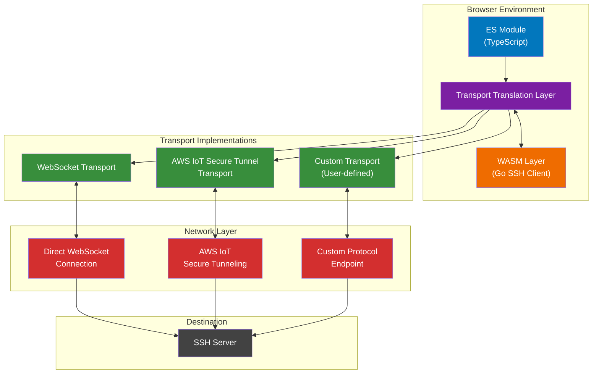

# Project: sshclient-wasm

This is a Golang project that builds a WASM client for ssh on the browser.

It uses Golang's [golang.org/x/crypto/ssh package](https://pkg.go.dev/golang.org/x/crypto/ssh) which already implements the SSH client protocol. It also works with servers but this project is focused on building a client that can be used in the browser with WebSockets.

The compiler target is WebAssembly. The build is done with GoReleaser.

It should ultimately be an NPM package that can be imported as an ES module for use in frontend projects like Next.js.

## Architecture

The architecture is transport-agnostic, supporting multiple transport protocols including raw WebSockets and AWS IoT Secure Tunneling. The Transport Translation Layer provides a unified interface for different transport implementations.

### Key Components

1. **ES Module (TypeScript)**: The public API that applications import and use
2. **Transport Translation Layer**: Bridges JavaScript transports with WASM, handling bidirectional data flow
3. **WASM Layer**: Go implementation of SSH client protocol using `golang.org/x/crypto/ssh`
4. **Transport Implementations**:
   - **WebSocket Transport**: Direct WebSocket connections to SSH servers
   - **AWS IoT Secure Tunnel Transport**: Implements AWS IoT protocol with frame encoding/decoding
   - **Custom Transport**: User-definable transport for proprietary protocols
5. **Network Layer**: The actual network connection (WebSocket, AWS IoT, etc.)
6. **SSH Server**: The destination SSH server

## Tech Stack

- Languages: Golang, TypeScript
- Frameworks: Next.js, React
- Build Tools: GoReleaser, Vite, Pnpm via Corepack
- Tools: WebSocket
- Testing: Vitest, GoTest
- Platforms: Browser

## Project Structure

- `main.go`: The entry point for the Go compiler.
- `pkg/sshclient/`: The SSH client implementation.
- `lib/`: The TypeScript/JavaScript bindings.
- `examples/`: Example applications.
- `dist/`: The build output.
- `node_modules/`: The Node.js dependencies.
- `pnpm-lock.yaml`: The Pnpm lock file.
- `package.json`: The NPM package configuration.
- `README.md`: The project README.
- `LICENSE`: The project license.

## Development

### Prerequisites

- Go 1.23+
- Node.js 22+
- Pnpm 10+

### Running the Go code during development

Running the Go code during development can be done with `go run main.go`.

### Building the WASM binary

Use `goreleaser build --snapshot --clean`.
