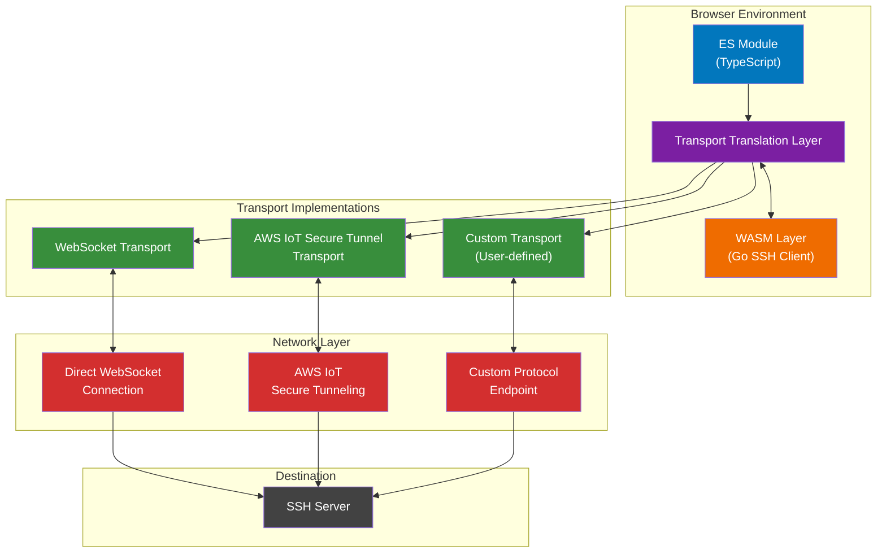

# sshclient-wasm

WebAssembly-based SSH client for the browser with transport-agnostic architecture. Built with Go's `golang.org/x/crypto/ssh` package and compiled to WASM for browser usage.

## Features

- 🔐 SSH client running entirely in the browser via WebAssembly
- 🔌 Transport-agnostic architecture supporting multiple protocols
- 🌐 Built-in support for WebSocket and AWS IoT Secure Tunneling
- 📦 Packet-level send/receive hooks for monitoring and transformation
- 🔄 Support for custom packet transformations (e.g., Protobuf encoding)
- 🔑 Password and private key authentication
- 📘 TypeScript support with full type definitions
- 🚀 ES Module compatible for modern frontend frameworks

## Architecture



## Installation

```bash
npm install sshclient-wasm
```

## Usage

### Basic WebSocket Connection

```javascript
import { SSHClient, WebSocketTransport } from 'sshclient-wasm';

// Initialize the WASM module
await SSHClient.initialize('/path/to/sshclient.wasm');

// Create a WebSocket transport
const transport = new WebSocketTransport(
  'transport-1',
  'wss://ssh-gateway.example.com',
  ['ssh']
);

// Connect to SSH server
const session = await SSHClient.connect(
  {
    host: 'example.com',
    port: 22,
    user: 'username',
    password: 'password'
  },
  transport
);

// Send data
await session.send(new Uint8Array([0x01, 0x02, 0x03]));

// Disconnect
await session.disconnect();
```

### AWS IoT Secure Tunnel Connection

```javascript
import { SSHClient, SecureTunnelTransport } from 'sshclient-wasm';

// Initialize the WASM module
await SSHClient.initialize('/path/to/sshclient.wasm');

// Create AWS IoT Secure Tunnel transport
const transport = new SecureTunnelTransport('tunnel-1', {
  region: 'us-east-1',
  accessToken: 'your-tunnel-access-token',
  clientMode: 'source',
  serviceId: 'SSH',
  protocol: 'V3'
});

// Connect through the secure tunnel
const session = await SSHClient.connect(
  {
    host: 'internal-server',
    port: 22,
    user: 'username',
    privateKey: 'ssh-private-key'
  },
  transport
);

// Use the SSH session
await session.send(encoder.encode('ls -la\n'));

// Disconnect
await session.disconnect();
```

### With Packet Hooks

```javascript
const transport = new WebSocketTransport('transport-1', 'wss://example.com');

const session = await SSHClient.connect(
  {
    host: 'example.com',
    port: 22,
    user: 'username',
    password: 'password'
  },
  transport,
  {
    onPacketSend: (data, metadata) => {
      console.log('Sending packet:', data, metadata);
    },
    onPacketReceive: (data, metadata) => {
      console.log('Received packet:', data, metadata);
    },
    onStateChange: (state) => {
      console.log('Connection state:', state);
    }
  }
);
```

### Packet Transformation

```javascript
import { PacketTransformer } from 'sshclient-wasm';

// Transform to/from Base64
const base64 = PacketTransformer.toBase64(data);
const binary = PacketTransformer.fromBase64(base64);

// Custom Protobuf transformation (implement your own logic)
const protobuf = PacketTransformer.toProtobuf(data, schema);
```

## Development

### Prerequisites

- Go 1.21+
- Node.js 16+
- Make

### Building from Source

```bash
# Clone the repository
git clone https://github.com/andrew/sshclient-wasm.git
cd sshclient-wasm

# Install dependencies
go mod download
npm install

# Build WASM and TypeScript
make build

# Run example
make dev
```

### Project Structure

```
sshclient-wasm/
├── main.go                 # WASM entry point
├── pkg/sshclient/         # Go SSH client implementation
│   ├── client.go          # Main client logic
│   └── interceptor.go     # Packet interception
├── lib/                   # TypeScript/JavaScript bindings
│   └── index.ts          # Main TypeScript API
├── example/              # Example application
└── dist/                 # Build output
```

## TypeScript API Reference

### Main Classes

#### SSHClient

The main entry point for establishing SSH connections through WebAssembly.

```typescript
class SSHClient {
  /**
   * Initialize the WASM module. Must be called before any other methods.
   * @param wasmPath - Path to the sshclient.wasm file
   */
  static async initialize(wasmPath?: string): Promise<void>

  /**
   * Connect to an SSH server through a transport
   * @param options - SSH connection configuration
   * @param transport - Transport implementation for network communication
   * @param callbacks - Optional callbacks for monitoring packet flow
   * @returns SSH session handle for sending data and disconnecting
   */
  static async connect(
    options: ConnectionOptions,
    transport: Transport,
    callbacks?: SSHClientCallbacks
  ): Promise<SSHSession>

  /**
   * Disconnect a specific SSH session
   * @param sessionId - The ID of the session to disconnect
   */
  static async disconnect(sessionId: string): Promise<void>

  /**
   * Get the library version
   * @returns Version string
   */
  static getVersion(): string
}
```

#### PacketTransformer

Utilities for transforming SSH packet data.

```typescript
class PacketTransformer {
  /**
   * Convert binary data to Base64 encoding
   * @param data - Binary data to encode
   * @returns Base64 encoded string
   */
  static toBase64(data: Uint8Array): string

  /**
   * Convert Base64 string to binary data
   * @param base64 - Base64 encoded string
   * @returns Decoded binary data
   */
  static fromBase64(base64: string): Uint8Array

  /**
   * Transform binary data to Protobuf format (user-implemented)
   * @param data - Binary data to transform
   * @param schema - Protobuf schema definition
   * @returns Protobuf encoded data
   */
  static toProtobuf(data: Uint8Array, schema?: any): Uint8Array

  /**
   * Transform Protobuf data to binary format (user-implemented)
   * @param data - Protobuf encoded data
   * @param schema - Protobuf schema definition
   * @returns Decoded binary data
   */
  static fromProtobuf(data: Uint8Array, schema?: any): Uint8Array
}
```

### Transport Implementations

#### WebSocketTransport

Direct WebSocket connection to SSH servers.

```typescript
class WebSocketTransport implements Transport {
  /**
   * Create a WebSocket transport
   * @param id - Unique identifier for this transport
   * @param url - WebSocket URL (e.g., 'wss://ssh-gateway.example.com')
   * @param protocols - Optional WebSocket subprotocols
   */
  constructor(id: string, url: string, protocols?: string[])

  async connect(): Promise<void>
  async disconnect(): Promise<void>
  async send(data: Uint8Array): Promise<void>
}
```

#### SecureTunnelTransport

AWS IoT Secure Tunneling transport for end-to-end encrypted connections.

```typescript
class SecureTunnelTransport implements Transport {
  /**
   * Create an AWS IoT Secure Tunnel transport
   * @param id - Unique identifier for this transport
   * @param config - Tunnel configuration
   */
  constructor(id: string, config: SecureTunnelConfig)

  async connect(): Promise<void>
  async disconnect(): Promise<void>
  async send(data: Uint8Array): Promise<void>
}
```

#### CustomTransport

User-defined transport for custom protocols.

```typescript
class CustomTransport implements Transport {
  /**
   * Create a custom transport with user-provided implementations
   * @param id - Unique identifier for this transport
   * @param connectImpl - Custom connection implementation
   * @param disconnectImpl - Custom disconnection implementation
   * @param sendImpl - Custom send implementation
   */
  constructor(
    id: string,
    connectImpl?: () => Promise<void>,
    disconnectImpl?: () => Promise<void>,
    sendImpl?: (data: Uint8Array) => Promise<void>
  )

  /**
   * Inject received data into the transport
   * @param data - Data received from the custom protocol
   */
  injectData(data: Uint8Array): void
}
```

### Interfaces

#### Transport

Base interface for all transport implementations.

```typescript
interface Transport {
  id: string
  connect(): Promise<void>
  disconnect(): Promise<void>
  send(data: Uint8Array): Promise<void>
  
  // Event handlers (set by the library)
  onData?: (data: Uint8Array) => void
  onError?: (error: Error) => void
  onClose?: () => void
}
```

#### ConnectionOptions

SSH connection configuration.

```typescript
interface ConnectionOptions {
  /** Target SSH server hostname */
  host: string
  
  /** SSH server port (default: 22) */
  port: number
  
  /** SSH username */
  user: string
  
  /** Password for authentication (optional) */
  password?: string
  
  /** Private key for authentication (optional) */
  privateKey?: string
  
  /** Connection timeout in milliseconds (optional) */
  timeout?: number
}
```

#### SecureTunnelConfig

AWS IoT Secure Tunnel configuration.

```typescript
interface SecureTunnelConfig {
  /** AWS region where the tunnel is created */
  region: string
  
  /** Tunnel access token */
  accessToken: string
  
  /** Client mode: 'source' or 'destination' */
  clientMode: 'source' | 'destination'
  
  /** Service identifier for multiplexed tunnels (optional) */
  serviceId?: string
  
  /** Protocol version: 'V2' or 'V3' (default: 'V2') */
  protocol?: 'V2' | 'V3'
}
```

#### SSHSession

SSH session handle returned from connect().

```typescript
interface SSHSession {
  /** Unique session identifier */
  sessionId: string
  
  /**
   * Send data through the SSH connection
   * @param data - Binary data to send
   */
  send(data: Uint8Array): Promise<void>
  
  /**
   * Close the SSH connection
   */
  disconnect(): Promise<void>
}
```

#### SSHClientCallbacks

Optional callbacks for monitoring SSH packet flow.

```typescript
interface SSHClientCallbacks {
  /**
   * Called when sending an SSH packet
   * @param data - Raw packet data being sent
   * @param metadata - Packet metadata (type, size, etc.)
   */
  onPacketSend?: (data: Uint8Array, metadata: PacketMetadata) => void
  
  /**
   * Called when receiving an SSH packet
   * @param data - Raw packet data received
   * @param metadata - Packet metadata (type, size, etc.)
   */
  onPacketReceive?: (data: Uint8Array, metadata: PacketMetadata) => void
  
  /**
   * Called when SSH connection state changes
   * @param state - New connection state
   */
  onStateChange?: (state: SSHConnectionState) => void
}
```

#### PacketMetadata

Metadata about SSH packets.

```typescript
interface PacketMetadata {
  /** Packet type identifier */
  packetType: string
  
  /** Packet type code */
  packetTypeCode: number
  
  /** Packet size in bytes */
  size: number
  
  /** Timestamp of packet */
  timestamp?: number
}
```

#### SSHConnectionState

SSH connection states.

```typescript
type SSHConnectionState = 
  | 'connecting'
  | 'connected'
  | 'authenticating'
  | 'authenticated'
  | 'ready'
  | 'disconnecting'
  | 'disconnected'
  | 'error'
```

### Enums

#### TunnelMessageType

AWS IoT Secure Tunnel message types.

```typescript
enum TunnelMessageType {
  UNKNOWN = 0,
  DATA = 1,
  STREAM_START = 2,
  STREAM_RESET = 3,
  SESSION_RESET = 4,
  SERVICE_IDS = 5,
  CONNECTION_START = 6,
  CONNECTION_RESET = 7
}
```

### Error Handling

All async methods throw errors that can be caught:

```typescript
try {
  await SSHClient.connect(options, transport)
} catch (error) {
  if (error.message.includes('authentication')) {
    // Handle authentication error
  } else if (error.message.includes('timeout')) {
    // Handle timeout error
  } else {
    // Handle general error
  }
}
```

### Examples

#### Custom Packet Transformation

```typescript
const session = await SSHClient.connect(
  connectionOptions,
  transport,
  {
    onPacketSend: (data, metadata) => {
      // Transform outgoing packets
      const transformed = PacketTransformer.toProtobuf(data, mySchema)
      console.log(`Sending ${metadata.packetType} packet (${metadata.size} bytes)`)
      return transformed
    },
    onPacketReceive: (data, metadata) => {
      // Process incoming packets
      const decoded = PacketTransformer.fromProtobuf(data, mySchema)
      console.log(`Received ${metadata.packetType} packet`)
      return decoded
    }
  }
)
```

#### Custom Transport Implementation

```typescript
class MyCustomTransport extends CustomTransport {
  constructor(id: string, config: MyConfig) {
    super(
      id,
      async () => {
        // Custom connection logic
        await this.establishConnection(config)
      },
      async () => {
        // Custom disconnection logic
        await this.closeConnection()
      },
      async (data: Uint8Array) => {
        // Custom send logic
        await this.sendData(data)
      }
    )
  }
  
  private async establishConnection(config: MyConfig) {
    // Implementation specific to your protocol
  }
  
  // Call this.injectData() when receiving data from your protocol
  handleIncomingData(data: Uint8Array) {
    this.injectData(data)
  }
}
```

## License

MIT