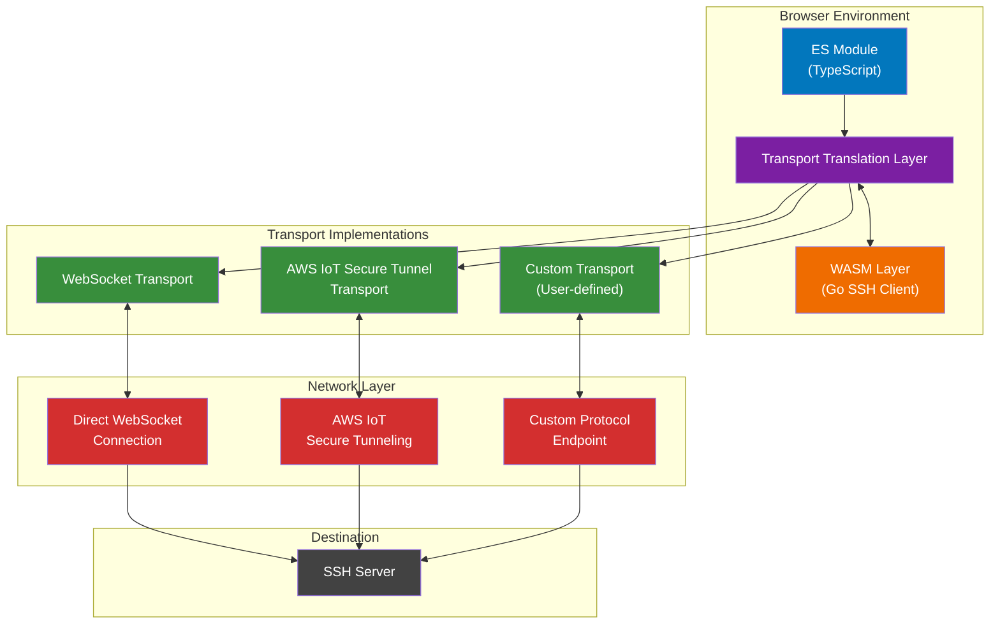

# sshclient-wasm

WebAssembly-based SSH client for the browser with transport-agnostic architecture. Built with Go's `golang.org/x/crypto/ssh` package and compiled to WASM for browser usage.

## Features

- 🔐 SSH client running entirely in the browser via WebAssembly
- 🔌 Transport-agnostic architecture supporting multiple protocols
- 🌐 Built-in support for WebSocket and AWS IoT Secure Tunneling
- 📦 Packet-level send/receive hooks for monitoring and transformation
- 🔄 Support for custom packet transformations (e.g., Protobuf encoding)
- 🔑 Password and private key authentication
- 📘 TypeScript support with full type definitions
- 🚀 ES Module compatible for modern frontend frameworks

## Architecture



## Installation

```bash
npm install sshclient-wasm
```

## Quick Start

### Installation & Setup

```bash
npm install sshclient-wasm
```

**Copy WASM files to your public directory:**

```bash
# Copy these files to your public/ directory:
# - sshclient.wasm
# - wasm_exec.js
```

### Framework-Specific Imports (Recommended)

```javascript
// Next.js optimized
import { initializeSSHClient, SSHClient, NextJSConfig } from "sshclient-wasm/next";

// Vite optimized
import { initializeSSHClient, SSHClient, ViteConfig } from "sshclient-wasm/vite";

// React hooks and utilities
import { useSSHClient, SSHClient } from "sshclient-wasm/react";

// Generic/universal import
import { SSHClient } from "sshclient-wasm";
```

### Quick Initialization

```javascript
// Framework-specific (auto-optimized)
import { initializeSSHClient } from "sshclient-wasm/next";
await initializeSSHClient();

// Or generic with auto-detection
import { SSHClient } from "sshclient-wasm";
await SSHClient.initialize();
```

## Usage Examples

### Basic WebSocket Connection

```javascript
import { SSHClient, WebSocketTransport } from "sshclient-wasm";

// Simple initialization - auto-detects assets in public directory
await SSHClient.initialize();

// Create a WebSocket transport
const transport = new WebSocketTransport(
  "transport-1",
  "wss://ssh-gateway.example.com",
  ["ssh"]
);

// Connect to SSH server
const session = await SSHClient.connect(
  {
    host: "example.com",
    port: 22,
    user: "username",
    password: "password",
  },
  transport
);

// Send data
await session.send(new Uint8Array([0x01, 0x02, 0x03]));

// Disconnect
await session.disconnect();
```

### Next.js Example

```javascript
import { initializeSSHClient, NextJSConfig } from "sshclient-wasm/next";
import { useEffect, useState } from "react";

function SSHComponent() {
  const [isReady, setIsReady] = useState(false);

  useEffect(() => {
    // Initialize with Next.js optimizations
    initializeSSHClient()
      .then(() => setIsReady(true))
      .catch((error) => {
        console.error("Failed to initialize SSH client:", error);
        // Error messages will guide you to fix asset placement
      });
  }, []);

  if (!isReady) return <div>Loading SSH client...</div>;

  // Your SSH logic here
  return <div>SSH client ready!</div>;
}

// Alternative: Use the React hook
import { useSSHClient } from "sshclient-wasm/react";

function SSHComponentWithHook() {
  const { isInitialized, initError, isLoading } = useSSHClient();

  if (isLoading) return <div>Loading SSH client...</div>;
  if (initError) return <div>Error: {initError.message}</div>;
  if (!isInitialized) return <div>SSH client not ready</div>;

  return <div>SSH client ready!</div>;
}
```

### Vite/React Example

```javascript
import { initializeSSHClient, ViteConfig } from "sshclient-wasm/vite";
import { useSSHConnection } from "sshclient-wasm/react";

function ViteSSHComponent() {
  const { connect, disconnect, session, connectionState } = useSSHConnection();

  useEffect(() => {
    initializeSSHClient();
  }, []);

  const handleConnect = async () => {
    const transport = new WebSocketTransport("transport-1", "wss://example.com");
    await connect({
      host: "example.com",
      port: 22,
      user: "username",
      password: "password"
    }, transport);
  };

  return (
    <div>
      <p>Status: {connectionState}</p>
      <button onClick={handleConnect}>Connect SSH</button>
      <button onClick={disconnect}>Disconnect</button>
    </div>
  );
}
```

### AWS IoT Secure Tunnel Connection

```javascript
import { SSHClient, SecureTunnelTransport } from "sshclient-wasm";

// Auto-initialize
await SSHClient.initialize();

// Create AWS IoT Secure Tunnel transport
const transport = new SecureTunnelTransport("tunnel-1", {
  region: "us-east-1",
  accessToken: "your-tunnel-access-token",
  clientMode: "source",
  serviceId: "SSH",
  protocol: "V3",
});

// Connect through the secure tunnel
const session = await SSHClient.connect(
  {
    host: "internal-server",
    port: 22,
    user: "username",
    privateKey: "ssh-private-key",
  },
  transport
);

// Use the SSH session
await session.send(encoder.encode("ls -la\n"));

// Disconnect
await session.disconnect();
```

### With Packet Hooks

```javascript
const transport = new WebSocketTransport("transport-1", "wss://example.com");

const session = await SSHClient.connect(
  {
    host: "example.com",
    port: 22,
    user: "username",
    password: "password",
  },
  transport,
  {
    onPacketSend: (data, metadata) => {
      console.log("Sending packet:", data, metadata);
    },
    onPacketReceive: (data, metadata) => {
      console.log("Received packet:", data, metadata);
    },
    onStateChange: (state) => {
      console.log("Connection state:", state);
    },
  }
);
```

### Packet Transformation

```javascript
import { PacketTransformer } from "sshclient-wasm";

// Transform to/from Base64
const base64 = PacketTransformer.toBase64(data);
const binary = PacketTransformer.fromBase64(base64);

// Custom Protobuf transformation (implement your own logic)
const protobuf = PacketTransformer.toProtobuf(data, schema);
```

## Framework-Specific Setup

### Next.js

**1. Copy WASM files to `public/`:**

```bash
cp node_modules/sshclient-wasm/dist/sshclient.wasm public/
cp node_modules/sshclient-wasm/dist/wasm_exec.js public/
```

**2. Use the Next.js configuration helper:**

```javascript
// next.config.js
import { NextJSConfig } from "sshclient-wasm/next";

/** @type {import('next').NextConfig} */
const nextConfig = NextJSConfig.getNextConfig({
  // Your custom Next.js config here
});

module.exports = nextConfig;
```

**Or configure manually:**

```javascript
/** @type {import('next').NextConfig} */
const nextConfig = {
  webpack: (config) => {
    config.experiments = { ...config.experiments, asyncWebAssembly: true };
    return config;
  },
  async headers() {
    return [
      {
        source: "/(.*)",
        headers: [
          { key: "Cross-Origin-Embedder-Policy", value: "require-corp" },
          { key: "Cross-Origin-Opener-Policy", value: "same-origin" },
        ],
      },
    ];
  },
};

module.exports = nextConfig;
```

**3. Use in your components:**

```javascript
import { initializeSSHClient, useSSHClient } from "sshclient-wasm/next";

// Method 1: Direct initialization
useEffect(() => {
  initializeSSHClient()
    .then(() => console.log("SSH client ready"))
    .catch(console.error);
}, []);

// Method 2: Using the hook (if using sshclient-wasm/react)
const { isInitialized, initError, isLoading } = useSSHClient();
```

### Vite/React

**1. Copy WASM files to `public/`:**

```bash
cp node_modules/sshclient-wasm/dist/sshclient.wasm public/
cp node_modules/sshclient-wasm/dist/wasm_exec.js public/
```

**2. Use the Vite configuration helper:**

```typescript
// vite.config.ts
import { defineConfig } from "vite";
import react from "@vitejs/plugin-react";
import { ViteConfig } from "sshclient-wasm/vite";

export default defineConfig(ViteConfig.getViteConfig({
  plugins: [react()],
  // Your custom Vite config here
}));
```

**Or configure manually:**

```typescript
import { defineConfig } from "vite";
import react from "@vitejs/plugin-react";

export default defineConfig({
  plugins: [react()],
  server: {
    headers: {
      "Cross-Origin-Embedder-Policy": "require-corp",
      "Cross-Origin-Opener-Policy": "same-origin",
    },
  },
});
```

**3. Use in your components:**

```javascript
import { initializeSSHClient } from "sshclient-wasm/vite";
import { useSSHClient } from "sshclient-wasm/react";

// Method 1: Direct initialization
useEffect(() => {
  initializeSSHClient()
    .then(() => console.log("SSH client ready"))
    .catch(console.error);
}, []);

// Method 2: Using React hooks
const { isInitialized, initError, isLoading } = useSSHClient();
```

### React Hooks & Utilities

The `sshclient-wasm/react` module provides React-specific hooks and utilities:

```javascript
import {
  useSSHClient,
  useSSHConnection,
  SSHClientProvider,
  withSSHClient
} from "sshclient-wasm/react";

// Hook for initialization
const { isInitialized, initError, isLoading } = useSSHClient();

// Hook for connection management
const { connect, disconnect, send, session, connectionState } = useSSHConnection();

// Provider for context
<SSHClientProvider options={{ cacheBusting: false }}>
  <YourApp />
</SSHClientProvider>

// HOC wrapper
const WrappedComponent = withSSHClient(YourComponent);
```

### Webpack/Generic

**1. Copy WASM files to your public directory**

**2. Initialize with custom options:**

```javascript
import { SSHClient } from "sshclient-wasm";

await SSHClient.initialize({
  publicDir: "/assets/", // Your public directory path
  autoDetect: true,
  cacheBusting: process.env.NODE_ENV === "development",
});
```

## Advanced Initialization Options

### Custom Paths

```javascript
import { SSHClient } from "sshclient-wasm";

await SSHClient.initialize({
  wasmPath: "/custom/path/sshclient.wasm",
  wasmExecPath: "/custom/path/wasm_exec.js",
  autoDetect: false,
  cacheBusting: false,
  timeout: 15000,
});
```

### Asset Availability Testing

```javascript
import { SSHClientHelpers } from "sshclient-wasm";

// Test if assets are properly placed
const { wasmAvailable, wasmExecAvailable } =
  await SSHClientHelpers.testAssetAvailability(
    "/sshclient.wasm",
    "/wasm_exec.js"
  );

if (!wasmAvailable) {
  console.error("❌ Please copy sshclient.wasm to your public directory");
}

if (!wasmExecAvailable) {
  console.error("❌ Please copy wasm_exec.js to your public directory");
}
```

### Error Handling & Troubleshooting

```javascript
try {
  await SSHClient.initialize();
} catch (error) {
  if (error.message.includes("WASM file not found")) {
    console.error("Copy sshclient.wasm to public/ directory");
  } else if (error.message.includes("wasm_exec.js not found")) {
    console.error("Copy wasm_exec.js to public/ directory");
  } else if (error.message.includes("Failed to fetch WASM")) {
    console.error("Check network connection and CORS headers");
  } else {
    console.error("Initialization failed:", error.message);
  }
}
```

## Development

### Prerequisites

- Go 1.21+
- Node.js 16+
- Make

### Building from Source

```bash
# Clone the repository
git clone https://github.com/andrew/sshclient-wasm.git
cd sshclient-wasm

# Install dependencies
go mod download
npm install

# Build WASM and TypeScript
make build

# Run example
make dev
```

### Project Structure

```
sshclient-wasm/
├── main.go                 # WASM entry point
├── pkg/sshclient/         # Go SSH client implementation
│   ├── client.go          # Main client logic
│   └── interceptor.go     # Packet interception
├── lib/                   # TypeScript/JavaScript bindings
│   └── index.ts          # Main TypeScript API
├── example/              # Example application
└── dist/                 # Build output
```

## TypeScript API Reference

### Main Classes

#### SSHClient

The main entry point for establishing SSH connections through WebAssembly.

```typescript
class SSHClient {
  /**
   * Initialize the WASM module. Must be called before any other methods.
   * @param options - Initialization options or legacy string path
   */
  static async initialize(
    options?: InitializationOptions | string
  ): Promise<void>;

  /**
   * Connect to an SSH server through a transport
   * @param options - SSH connection configuration
   * @param transport - Transport implementation for network communication
   * @param callbacks - Optional callbacks for monitoring packet flow
   * @returns SSH session handle for sending data and disconnecting
   */
  static async connect(
    options: ConnectionOptions,
    transport: Transport,
    callbacks?: SSHClientCallbacks
  ): Promise<SSHSession>;

  /**
   * Disconnect a specific SSH session
   * @param sessionId - The ID of the session to disconnect
   */
  static async disconnect(sessionId: string): Promise<void>;

  /**
   * Get the library version
   * @returns Version string
   */
  static getVersion(): string;
}
```

#### PacketTransformer

Utilities for transforming SSH packet data.

```typescript
class PacketTransformer {
  /**
   * Convert binary data to Base64 encoding
   * @param data - Binary data to encode
   * @returns Base64 encoded string
   */
  static toBase64(data: Uint8Array): string;

  /**
   * Convert Base64 string to binary data
   * @param base64 - Base64 encoded string
   * @returns Decoded binary data
   */
  static fromBase64(base64: string): Uint8Array;

  /**
   * Transform binary data to Protobuf format (user-implemented)
   * @param data - Binary data to transform
   * @param schema - Protobuf schema definition
   * @returns Protobuf encoded data
   */
  static toProtobuf(data: Uint8Array, schema?: any): Uint8Array;

  /**
   * Transform Protobuf data to binary format (user-implemented)
   * @param data - Protobuf encoded data
   * @param schema - Protobuf schema definition
   * @returns Decoded binary data
   */
  static fromProtobuf(data: Uint8Array, schema?: any): Uint8Array;
}
```

### Transport Implementations

#### WebSocketTransport

Direct WebSocket connection to SSH servers.

```typescript
class WebSocketTransport implements Transport {
  /**
   * Create a WebSocket transport
   * @param id - Unique identifier for this transport
   * @param url - WebSocket URL (e.g., 'wss://ssh-gateway.example.com')
   * @param protocols - Optional WebSocket subprotocols
   */
  constructor(id: string, url: string, protocols?: string[]);

  async connect(): Promise<void>;
  async disconnect(): Promise<void>;
  async send(data: Uint8Array): Promise<void>;
}
```

#### SecureTunnelTransport

AWS IoT Secure Tunneling transport for end-to-end encrypted connections.

```typescript
class SecureTunnelTransport implements Transport {
  /**
   * Create an AWS IoT Secure Tunnel transport
   * @param id - Unique identifier for this transport
   * @param config - Tunnel configuration
   */
  constructor(id: string, config: SecureTunnelConfig);

  async connect(): Promise<void>;
  async disconnect(): Promise<void>;
  async send(data: Uint8Array): Promise<void>;
}
```

#### CustomTransport

User-defined transport for custom protocols.

```typescript
class CustomTransport implements Transport {
  /**
   * Create a custom transport with user-provided implementations
   * @param id - Unique identifier for this transport
   * @param connectImpl - Custom connection implementation
   * @param disconnectImpl - Custom disconnection implementation
   * @param sendImpl - Custom send implementation
   */
  constructor(
    id: string,
    connectImpl?: () => Promise<void>,
    disconnectImpl?: () => Promise<void>,
    sendImpl?: (data: Uint8Array) => Promise<void>
  );

  /**
   * Inject received data into the transport
   * @param data - Data received from the custom protocol
   */
  injectData(data: Uint8Array): void;
}
```

#### SSHClientHelpers

Framework-specific helpers and utilities.

```typescript
class SSHClientHelpers {
  /**
   * Get recommended asset paths for the detected framework
   */
  static getAssetPaths: (publicDir?: string) => {
    wasmPath: string;
    wasmExecPath: string;
  };

  /**
   * Detect the current framework
   */
  static detectFramework: () => "nextjs" | "vite" | "webpack" | "generic";

  /**
   * Test if WASM assets are available at the given paths
   */
  static testAssetAvailability: (
    wasmPath: string,
    wasmExecPath: string
  ) => Promise<{
    wasmAvailable: boolean;
    wasmExecAvailable: boolean;
  }>;

  /**
   * Next.js specific initialization helper
   */
  static initializeForNextJS: (
    options?: Partial<InitializationOptions>
  ) => Promise<void>;

  /**
   * Vite specific initialization helper
   */
  static initializeForVite: (
    options?: Partial<InitializationOptions>
  ) => Promise<void>;

  /**
   * Generic initialization with sensible defaults
   */
  static initializeWithDefaults: (
    customOptions?: Partial<InitializationOptions>
  ) => Promise<void>;
}
```

### Interfaces

#### InitializationOptions

Configuration options for initializing the SSH client.

```typescript
interface InitializationOptions {
  /** Path to the WASM file (default: auto-detected) */
  wasmPath?: string;

  /** Path to the wasm_exec.js file (default: auto-detected) */
  wasmExecPath?: string;

  /** Enable automatic path detection (default: true) */
  autoDetect?: boolean;

  /** Public directory path for auto-detection (default: '/') */
  publicDir?: string;

  /** Enable cache busting for development (default: true) */
  cacheBusting?: boolean;

  /** Timeout for loading assets in milliseconds (default: 10000) */
  timeout?: number;
}
```

#### Transport

Base interface for all transport implementations.

```typescript
interface Transport {
  id: string;
  connect(): Promise<void>;
  disconnect(): Promise<void>;
  send(data: Uint8Array): Promise<void>;

  // Event handlers (set by the library)
  onData?: (data: Uint8Array) => void;
  onError?: (error: Error) => void;
  onClose?: () => void;
}
```

#### ConnectionOptions

SSH connection configuration.

```typescript
interface ConnectionOptions {
  /** Target SSH server hostname */
  host: string;

  /** SSH server port (default: 22) */
  port: number;

  /** SSH username */
  user: string;

  /** Password for authentication (optional) */
  password?: string;

  /** Private key for authentication (optional) */
  privateKey?: string;

  /** Connection timeout in milliseconds (optional) */
  timeout?: number;
}
```

#### SecureTunnelConfig

AWS IoT Secure Tunnel configuration.

```typescript
interface SecureTunnelConfig {
  /** AWS region where the tunnel is created */
  region: string;

  /** Tunnel access token */
  accessToken: string;

  /** Client mode: 'source' or 'destination' */
  clientMode: "source" | "destination";

  /** Service identifier for multiplexed tunnels (optional) */
  serviceId?: string;

  /** Protocol version: 'V2' or 'V3' (default: 'V2') */
  protocol?: "V2" | "V3";
}
```

#### SSHSession

SSH session handle returned from connect().

```typescript
interface SSHSession {
  /** Unique session identifier */
  sessionId: string;

  /**
   * Send data through the SSH connection
   * @param data - Binary data to send
   */
  send(data: Uint8Array): Promise<void>;

  /**
   * Close the SSH connection
   */
  disconnect(): Promise<void>;
}
```

#### SSHClientCallbacks

Optional callbacks for monitoring SSH packet flow.

```typescript
interface SSHClientCallbacks {
  /**
   * Called when sending an SSH packet
   * @param data - Raw packet data being sent
   * @param metadata - Packet metadata (type, size, etc.)
   */
  onPacketSend?: (data: Uint8Array, metadata: PacketMetadata) => void;

  /**
   * Called when receiving an SSH packet
   * @param data - Raw packet data received
   * @param metadata - Packet metadata (type, size, etc.)
   */
  onPacketReceive?: (data: Uint8Array, metadata: PacketMetadata) => void;

  /**
   * Called when SSH connection state changes
   * @param state - New connection state
   */
  onStateChange?: (state: SSHConnectionState) => void;
}
```

#### PacketMetadata

Metadata about SSH packets.

```typescript
interface PacketMetadata {
  /** Packet type identifier */
  packetType: string;

  /** Packet type code */
  packetTypeCode: number;

  /** Packet size in bytes */
  size: number;

  /** Timestamp of packet */
  timestamp?: number;
}
```

#### SSHConnectionState

SSH connection states.

```typescript
type SSHConnectionState =
  | "connecting"
  | "connected"
  | "authenticating"
  | "authenticated"
  | "ready"
  | "disconnecting"
  | "disconnected"
  | "error";
```

### Enums

#### TunnelMessageType

AWS IoT Secure Tunnel message types.

```typescript
enum TunnelMessageType {
  UNKNOWN = 0,
  DATA = 1,
  STREAM_START = 2,
  STREAM_RESET = 3,
  SESSION_RESET = 4,
  SERVICE_IDS = 5,
  CONNECTION_START = 6,
  CONNECTION_RESET = 7,
}
```

## Troubleshooting

### Common Issues

#### ❌ "WASM file not found"

```bash
# Solution: Copy WASM files to public directory
cp node_modules/sshclient-wasm/dist/sshclient.wasm public/
cp node_modules/sshclient-wasm/dist/wasm_exec.js public/
```

#### ❌ "Failed to fetch WASM file: 404"

- Verify files are in your public directory
- Check that your web server serves static files from public/
- Ensure file paths are correct (case-sensitive on some servers)

#### ❌ "Go runtime not loaded"

- Ensure `wasm_exec.js` is accessible and loads successfully
- Check browser console for script loading errors
- Verify CORS headers allow script loading

#### ❌ "Cross-origin requests blocked"

**Next.js users:** Add CORS headers to `next.config.js`:

```javascript
async headers() {
  return [{
    source: '/(.*)',
    headers: [
      { key: 'Cross-Origin-Embedder-Policy', value: 'require-corp' },
      { key: 'Cross-Origin-Opener-Policy', value: 'same-origin' },
    ],
  }];
}
```

**Vite users:** Add to `vite.config.ts`:

```typescript
server: {
  headers: {
    'Cross-Origin-Embedder-Policy': 'require-corp',
    'Cross-Origin-Opener-Policy': 'same-origin',
  },
}
```

#### ❌ "WebAssembly.instantiate failed"

- Your browser may not support WebAssembly
- WASM file may be corrupted or incompatible
- Try clearing browser cache

### Debug Helpers

#### Test Asset Availability

```typescript
import { SSHClientHelpers } from "sshclient-wasm";

const result = await SSHClientHelpers.testAssetAvailability(
  "/sshclient.wasm",
  "/wasm_exec.js"
);

console.log("WASM available:", result.wasmAvailable);
console.log("Exec available:", result.wasmExecAvailable);
```

#### Check Framework Detection

```typescript
import { SSHClientHelpers } from "sshclient-wasm";

console.log("Detected framework:", SSHClientHelpers.detectFramework());
console.log("Recommended paths:", SSHClientHelpers.getAssetPaths());
```

### Error Handling

All async methods throw errors that can be caught:

```typescript
try {
  await SSHClient.initialize();
  await SSHClient.connect(options, transport);
} catch (error) {
  if (error.message.includes("WASM file not found")) {
    console.error("📁 Copy sshclient.wasm to public/ directory");
  } else if (error.message.includes("wasm_exec.js not found")) {
    console.error("📁 Copy wasm_exec.js to public/ directory");
  } else if (error.message.includes("Failed to fetch WASM")) {
    console.error("🌐 Check network connection and CORS headers");
  } else if (error.message.includes("authentication")) {
    console.error("🔐 Check SSH credentials");
  } else if (error.message.includes("timeout")) {
    console.error("⏰ Connection or initialization timeout");
  } else {
    console.error("❌ Unknown error:", error.message);
  }
}
```

### Performance Tips

- **Cache Busting**: Disable in production for better performance
- **Asset Preloading**: Consider preloading WASM files for faster initialization
- **Memory Usage**: Monitor memory usage for long-running sessions
- **Connection Pooling**: Reuse transports when possible

### Examples

#### Custom Packet Transformation

```typescript
const session = await SSHClient.connect(connectionOptions, transport, {
  onPacketSend: (data, metadata) => {
    // Transform outgoing packets
    const transformed = PacketTransformer.toProtobuf(data, mySchema);
    console.log(
      `Sending ${metadata.packetType} packet (${metadata.size} bytes)`
    );
    return transformed;
  },
  onPacketReceive: (data, metadata) => {
    // Process incoming packets
    const decoded = PacketTransformer.fromProtobuf(data, mySchema);
    console.log(`Received ${metadata.packetType} packet`);
    return decoded;
  },
});
```

#### Custom Transport Implementation

```typescript
class MyCustomTransport extends CustomTransport {
  constructor(id: string, config: MyConfig) {
    super(
      id,
      async () => {
        // Custom connection logic
        await this.establishConnection(config);
      },
      async () => {
        // Custom disconnection logic
        await this.closeConnection();
      },
      async (data: Uint8Array) => {
        // Custom send logic
        await this.sendData(data);
      }
    );
  }

  private async establishConnection(config: MyConfig) {
    // Implementation specific to your protocol
  }

  // Call this.injectData() when receiving data from your protocol
  handleIncomingData(data: Uint8Array) {
    this.injectData(data);
  }
}
```

## License

BSD-3-Clause
